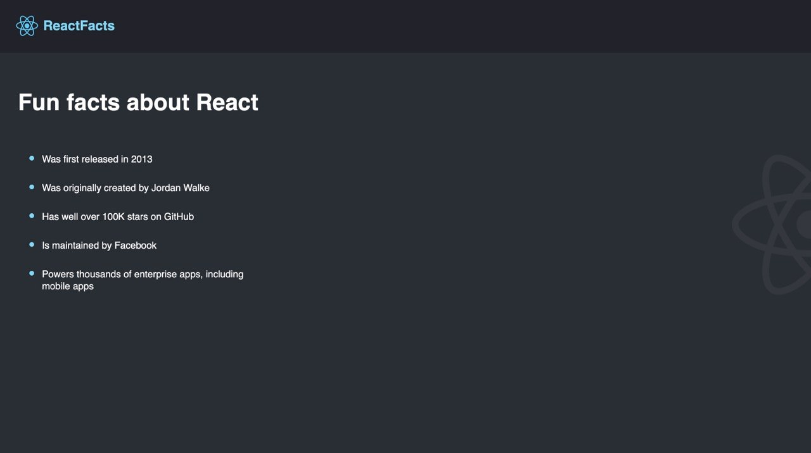

# React Facts

A simple React application built with React and Vite while learning the fundamentals of React.

This project focuses on component-based development, JSX, importing assets, and organizing a React project.

## Preview



## Features

- Reusable React components
- JSX syntax
- Component-based UI
- Image importing
- CSS styling
- Organized folder structure

## Technologies Used

- React
- Vite
- JavaScript (ES6+)
- CSS3
- HTML5

## Folder Structure

```
src/
├── assets/
│   └── images/
├── components/
│   ├── Navbar.jsx
│   ├── Main.jsx
│   └── index.css
├── App.jsx
└── main.jsx
```

## Getting Started

Clone the repository

```bash
git clone <repository-url>
```

Install dependencies

```bash
npm install
```

Run the development server

```bash
npm run dev
```

## What I Learned

- Setting up a React project with Vite
- Creating and importing components
- Organizing a React project
- Importing images and CSS
- Understanding relative file paths
- Rendering React components

## Future Improvements

- Make the page responsive
- Add Dark/Light mode
- Add animations
- Convert the facts into reusable components using props

---

Made while learning React 🚀